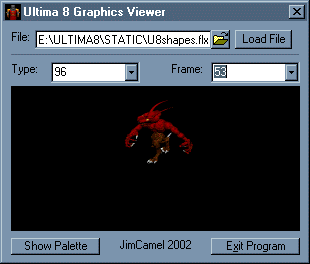



## Ultima 8 Graphics viewer

### Description

For some reason about a month ago I felt this urge to suddenly start playing Ultima 8 again. For those of you who don't know, Ultima 8 is one of the Ultima series of games (most recently Ultima Online), which was a Dos game around in 1994/1995. Anyways, this program allows you to view the graphics (or some of them at least, it seems to have problems decoding some files) which come with it. I got the format from http://members.iinet.net.au/~garydep/ultima8.html, and there is some other borrowed code in here. Oh yeah, this program is essentially useless if you don't have Ultima 8, unless you feel like reading the well commented code to get a better understanding of low level file reading.
 
### More Info
 

             |
---                |---
**Submitted On**   |2002-04-16 03:15:56
**By**             |[JimCamel](https://github.com/Planet-Source-Code/PSCIndex/blob/master/ByAuthor/jimcamel.md)
**Level**          |Intermediate
**User Rating**    |5.0 (25 globes from 5 users)
**Compatibility**  |VB 5\.0, VB 6\.0
**Category**       |[Games](https://github.com/Planet-Source-Code/PSCIndex/blob/master/ByCategory/games__1-38.md)
**World**          |[Visual Basic](https://github.com/Planet-Source-Code/PSCIndex/blob/master/ByWorld/visual-basic.md)
**Archive File**   |[Ultima\_8\_G721934152002\.zip](https://github.com/Planet-Source-Code/jimcamel-ultima-8-graphics-viewer__1-33827/archive/master.zip)

